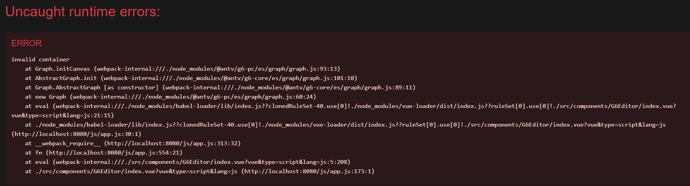

# FrontEndDemo

> npm install -g @vue/clivue
> vue -v
> vue create vue-ui

> npm install --save @antv/g6@5.0.17
> npm uninstall @antv/g6
> npm install --save @antv/g6@5.0.5
> npm install --save @antv/g6@4.8.21
> npm install --save @antv/g6@3.8.3
> npm install --save vue-router
> npm install vue-template-compiler --save-dev

## vue3-router-example
> https://github.com/udsgit/vue3-router-example/blob/master/src/components/UserInfo.vue

## babeljs
https://babeljs.io/docs/babel-plugin-transform-private-methods

## Ant v G6
> [Ant V g6](https://g6-next.antv.antgroup.com/zh/examples/plugin/edge-filter-lens/#basic)
> https://www.yuque.com/antv/g6/quick-start
> https://github.com/Jim-jw/g6-in-vue/blob/main/src/plugins/data.js
> [vue g6 hello world](https://blog.csdn.net/clj198606061111/article/details/90762216)
> [g6_learning](https://gitee.com/breencl/g6_learning)
> [可视化—AntV G6 紧凑树实现节点与边动态样式、超过X条展示更多等实用小功能](https://blog.csdn.net/angel1003645956/article/details/130437664)
> [VUE实战6：鼠标悬停显示弹出窗口](https://segmentfault.com/a/1190000021931905) - https://github.com/codebdy/rxdrag
> [提示框](https://g6-next.antv.antgroup.com/zh/examples/plugin/tooltip/#basic)
> [vue3 element plus](https://gitee.com/jxywb/vue3-element.git)
- [AntV G6 Event](http://g6-v3-2.antv.vision/zh/docs/api/Event)
- [element-plus](https://element-plus.org/en-US/component/dialog)
- [G6使用踩坑记录](https://juejin.cn/post/7158703724695650311) - G6.Menu
- [antv g6右击节点自定义上下文菜单实现](https://blog.csdn.net/weixin_43123984/article/details/126284800)
> https://g6-next.antv.antgroup.com/api/graph/option


# ISSUES

## 关于“Class private methods are not enabled.”问题
```js
https://juejin.cn/post/7252684331712643132
Module build failed (from ./node_modules/@vue/cli-plugin-babel/node_modules/babel-loader/lib/index.js):
SyntaxError: D:\VSCODE\building\project_all_1.1\project1.1\node_modules\marked\lib\marked.esm.js: Class private methods are not enabled. Please add `@babel/plugin-transform-private-methods` to your configuration.

module.exports = {
  presets: [
    '@vue/cli-plugin-babel/preset'
  ],
  plugins: [
    ["@babel/plugin-transform-private-methods",{"loose":true}],
    ["@babel/plugin-transform-class-properties", {
      "loose": true
    }],
    ["@babel/plugin-transform-private-property-in-object", {
      "loose": true
    }]
  ]

}
```

# types.js:39 Uncaught TypeError: Cannot read property ‘prototype‘ of undefined
```
因为使用的是vue3.0 cli- 不兼容element ui
https://blog.csdn.net/weixin_44763595/article/details/117987906
```

## 4.8.21
